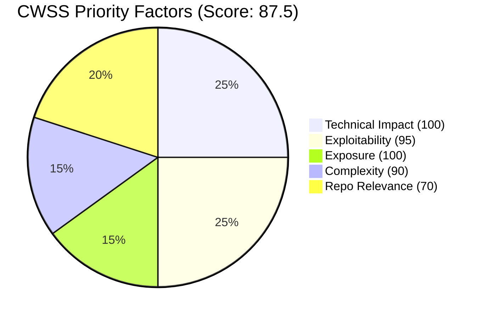

# Vulnetix Exploit Analysis Skill

This skill analyzes exploit intelligence for a specific vulnerability (CVE, GHSA, etc.) and assesses its impact against the current repository. **This skill does not modify application code** — it only updates `.vulnetix/memory.yaml` to track findings. Use `/vulnetix:fix` for remediation.

## Output & Analysis Guidelines

**Primary output format:** Markdown. All reports, tables, assessments, and evidence summaries MUST be presented as formatted markdown text directly — never generate scripts or programs to produce output that can be expressed as markdown.

**Visual data — use Mermaid diagrams** to display data visually when it aids comprehension. Mermaid renders natively in markdown and requires no external tools. Use it for:
- Attack path / kill chain visualization → `graph TD`
- CWSS factor breakdown → `pie` or `quadrantChart`
- Exploit timeline (discovery dates, PoC releases) → `timeline`
- Threat model reachability → `flowchart` (dependency → vulnerable code → exposure)
- Priority comparison across multiple vulns → `bar` or `xychart-beta`

Example — CWSS factor breakdown:
````markdown

````

Example — attack path:
````markdown

````

**If `uv` is available**, richer visualizations can be generated with Python (matplotlib, plotly) and saved to `.vulnetix/`:
```bash
command -v uv &>/dev/null && uv run --with matplotlib python3 -c '
import matplotlib.pyplot as plt
# ... generate chart ...
plt.savefig(".vulnetix/chart.png", dpi=150, bbox_inches="tight")
'
```
When Python charts are generated, display them inline and keep the Mermaid version as a text fallback.

**Data processing — tooling cascade (strict order):**

1. **jq / yq + bash builtins** (preferred) — `jq` for JSON extraction/filtering (API responses, CycloneDX SBOMs), `yq` for YAML (memory file reads). Pipe to `head`, `tail`, `cut`, `sed`, `grep`, `sort`, `uniq`, `wc` for shaping.
2. **uv** (for complex analysis or charts) — If CWSS scoring, statistical aggregation, or visualization beyond Mermaid are needed, check `uv` first:
   ```bash
   command -v uv &>/dev/null && uv run --with pandas,matplotlib python3 -c '...'
   ```
3. **python3 stdlib** (last resort) — Only if `uv` is unavailable. Use `json`, `csv`, `collections`, `statistics`, `math` modules — **no pip dependencies**:
   ```bash
   command -v python3 &>/dev/null && python3 -c 'import json, sys; ...'
   ```

**Never assume any runtime is available** — always check with `command -v` before use. If all programmatic tools are unavailable, perform CWSS calculations manually and present results as markdown with Mermaid diagrams.

**CWE pattern matching** (Step 5 `grep` commands for code analysis) uses the Grep tool directly — these are not data processing and are exempt from this cascade.

## Vulnerability Memory (.vulnetix/memory.yaml)

This skill reads and updates the `.vulnetix/memory.yaml` file in the repository root. This file is shared with `/vulnetix:fix` and `/vulnetix:package-search` and tracks all vulnerability encounters, threat models, priority scores, and user decisions across sessions.

### Schema

The canonical schema is defined in `/vulnetix:fix`. This skill adds and maintains the `threat_model` and `cwss` fields on each vulnerability entry. The full per-vulnerability entry structure:

```yaml
# .vulnetix/memory.yaml
# Auto-maintained by Vulnetix Claude Code Plugin
# Do not remove — tracks vulnerability decisions and fix history

schema_version: 1
vulnerabilities:
  CVE-2021-44228:                       # Primary vuln ID (key)
    aliases:                             # Other IDs for the same vuln
      - GHSA-jfh8-c2jp-5v3q
    package: log4j-core
    ecosystem: maven
    discovery:
      date: "2024-01-15T10:30:00Z"      # ISO 8601 UTC
      source: manifest                   # manifest | lockfile | sbom | scan | user | hook
      file: pom.xml                      # The manifest where it was found
      sbom: .vulnetix/scans/pom.xml.cdx.json  # CycloneDX v1.7 SBOM (when produced by scan/hook)
    versions:
      current: "2.14.1"
      current_source: "lockfile: pom.xml"
      fixed_in: "2.17.1"
      fix_source: "registry: Maven Central"
    severity: critical                   # critical | high | medium | low | unknown
    safe_harbour: 0.82                   # 0.00-1.00 confidence score
    status: affected                     # VEX: not_affected | affected | fixed | under_investigation
    justification: null                  # VEX justification (for not_affected)
    action_response: null                # VEX action (for affected)
    threat_model:                        # Populated by /vulnetix:exploits
      techniques:                        # MITRE ATT&CK technique IDs (internal reference)
        - T1190
        - T1059
      tactics:                           # Developer-friendly descriptions (shown to user)
        - "Attackable from the internet"
        - "Can run arbitrary commands"
      attack_vector: network             # network | local | adjacent | physical
      attack_complexity: low             # low | high
      privileges_required: none          # none | low | high
      user_interaction: none             # none | required
      reachability: direct               # direct | transitive | not-found | unknown
      exposure: public-facing            # public-facing | internal | local-only | unknown
    pocs:                                # PoC sources (static analysis only, never executed)
      - url: "https://exploit-db.com/exploits/12345"
        source: exploitdb
        type: poc                        # poc | exploit-framework | article
        local_path: ".vulnetix/pocs/CVE-2021-44228/exploit_12345.py"
        fetched_date: "2024-01-15T10:35:00Z"
        verified: true
        analysis: "RCE via JNDI lookup injection, network vector, no auth required"
    cwss:                                # CWSS-derived priority scoring
      score: 87.5                        # 0-100 composite priority score
      priority: P1                       # P1 | P2 | P3 | P4
      factors:
        technical_impact: 100            # 0-100 from CVSS impact / CWE consequence
        exploitability: 95               # 0-100 from EPSS, exploit availability
        exposure: 100                    # 0-100 from attack vector + repo deployment
        complexity: 90                   # 0-100 inverted (higher = easier to exploit)
        repo_relevance: 70               # 0-100 from dependency relationship, reachability
    decision:
      choice: investigating              # See Decision Values below
      reason: "Exploit analysis in progress"
      date: "2024-01-15T10:30:00Z"
    history:                             # Append-only event log
      - date: "2024-01-15T10:30:00Z"
        event: discovered
        detail: "Found via /vulnetix:exploits CVE-2021-44228"
      - date: "2024-01-15T10:35:00Z"
        event: exploit-analysis
        detail: "3 public exploits, EPSS 0.97, Metasploit module, CISA KEV listed. CWSS 87.5 (P1)."
```

### MITRE ATT&CK Mapping

Use ATT&CK technique IDs internally in `threat_model.techniques`. **Always communicate to the user using the developer-friendly language in `threat_model.tactics`.** Never surface ATT&CK IDs, tactic names, or technique names to the user — those are internal metadata only.

| ATT&CK ID | ATT&CK Name | Developer Language (store in `tactics`) |
|---|---|---|
| T1190 | Exploit Public-Facing Application | "Attackable from the internet — web app or API is the entry point" |
| T1195.001 | Supply Chain: Compromise Software Dependencies | "Compromised dependency — malicious code injected via a package you use" |
| T1195.002 | Supply Chain: Compromise Software Supply Chain | "Tampered build or distribution — the package source or registry was compromised" |
| T1059 | Command and Scripting Interpreter | "Can run arbitrary commands on your server" |
| T1203 | Exploitation for Client Execution | "Exploitable via user interaction — opening a file or clicking a link triggers it" |
| T1068 | Exploitation for Privilege Escalation | "Can escalate to admin or root access" |
| T1210 | Exploitation of Remote Services | "Exploitable over the network between services" |
| T1212 | Exploitation for Credential Access | "Can steal credentials — passwords, tokens, or keys" |
| T1005 | Data from Local System | "Can read sensitive data — files, env vars, or secrets on the host" |
| T1499 | Endpoint Denial of Service | "Can crash your service or exhaust resources" |
| T1565 | Data Manipulation | "Can tamper with, corrupt, or inject data" |

**How to select techniques:** Map from the CWE, CVSS vector, and exploit analysis:
- CWE-78/CWE-77 (OS/Command injection) → T1059
- CWE-502 (Deserialization) → T1059 + T1068
- CWE-89 (SQL injection) → T1005 + T1565
- CWE-79 (XSS) → T1203 + T1212
- CWE-22 (Path traversal) → T1005
- CWE-400/CWE-770 (Resource exhaustion) → T1499
- CWE-306/CWE-287 (Auth issues) → T1068
- CVSS AV:N → T1190 or T1210
- Supply chain advisory → T1195.001 or T1195.002
- RCE impact → T1059
- Privilege escalation impact → T1068
- Info disclosure impact → T1005 or T1212

Multiple techniques may apply to a single vulnerability.

### CWSS Priority Scoring

Compute a CWSS-derived priority score (0–100) from Vulnetix data to help developers decide what to fix first. This uses Common Weakness Scoring System principles simplified into five factors that map directly to available API data and repo analysis.

**Factors:**

| Factor | Weight | Source | How to score (0–100) |
|---|---|---|---|
| Technical Impact | 25% | CVSS impact sub-score, CWE consequence | RCE → 100, Priv escalation → 90, Data exfil → 85, Data tampering → 70, DoS → 40, Info disclosure → 30 |
| Exploitability | 25% | EPSS score, exploit records, CISA KEV | Base: EPSS × 100. Adjustments: Metasploit module → +20, Verified PoC → +15, CISA KEV → +15. Cap at 100. |
| Exposure | 15% | CVSS attack vector + repo deployment analysis | Network + public-facing → 100, Network + internal → 70, Adjacent → 50, Local → 30, Physical → 10 |
| Complexity | 15% | CVSS attack complexity, privileges, user interaction (inverted: higher = easier to exploit) | Low complexity + no auth + no interaction → 100. Each: high complexity → −30, auth required → −25, interaction required → −20. Floor at 0. |
| Repo Relevance | 20% | Dependency analysis from Step 5 | Direct dep + reachable code → 100, Direct dep + unknown reachability → 70, Transitive dep → 40, Not found → 0 |

**Composite score:**

```
CWSS = (technical_impact × 0.25) + (exploitability × 0.25) + (exposure × 0.15) + (complexity × 0.15) + (repo_relevance × 0.20)
```

**Priority tiers** (shown to user):

| Priority | Score Range | Developer Language |
|---|---|---|
| **P1** | ≥ 80 | "Act now — actively exploited, trivial to attack, you're exposed" |
| **P2** | 60–79 | "Plan this sprint — public exploits exist, you're likely affected" |
| **P3** | 40–59 | "Schedule it — known issue, limited exploitability or exposure" |
| **P4** | < 40 | "Track it — low risk, no known exploitation, limited exposure" |

### Risk Treatment Decisions

When the user makes a decision about a vulnerability, map it to one of four risk treatment categories. Use these categories as internal guidance only — **always communicate using the developer-friendly language**.

| Treatment | Decision Choice | Developer Language | When to use |
|---|---|---|---|
| **Mitigate** | `fix-applied` | "Fix applied" | Upgraded, patched, or code fixed |
| **Mitigate** | `mitigated` | "Workaround in place" | Config change, input validation, selective import |
| **Accept** | `risk-accepted` | "Risk acknowledged, shipping as-is" | Consciously accepting with documented reason |
| **Accept** | `deferred` | "Fix planned for later" | Will address, but not right now |
| **Avoid** | `risk-avoided` | "Removed the exposure" | Dependency removed, feature disabled, not deployed |
| **Avoid** | `inlined` | "Replaced with own code" | Dependency replaced with first-party implementation |
| **Avoid** | `not-affected` | "Not affected" | Vuln doesn't apply — package absent, code unreachable |
| **Transfer** | `risk-transferred` | "Handled by platform or infrastructure" | WAF, CDN, runtime sandbox, managed service handles it |

VEX status mapping (internal → developer language, same as `/vulnetix:fix`):

| VEX Status | Developer Language |
|---|---|
| `not_affected` | "Not affected" |
| `affected` | "Vulnerable" |
| `fixed` | "Fixed" |
| `under_investigation` | "Investigating" |

### Dependabot Integration

When `gh` CLI is available (check with `gh auth status 2>/dev/null`), query Dependabot alerts for the current vuln ID to enrich exploit analysis context. The canonical Dependabot-to-VEX mapping is defined in `/vulnetix:fix`. This skill uses it read-only — it records Dependabot state in the memory file but does not change alert states on GitHub.

**During Step 1 (Load Vulnerability Memory):**
1. If `gh` is available, query Dependabot alerts matching this vuln ID:
   ```bash
   gh api repos/{owner}/{repo}/dependabot/alerts --jq '[.[] | select(.security_advisory.cve_id == "'"$ARGUMENTS"'" or .security_advisory.ghsa_id == "'"$ARGUMENTS"'")] | first'
   ```
2. If a matching alert exists, include in the prior state display:
   ```
   Dependabot alert #<N>: <developer-friendly state>
   ```
3. If a Dependabot PR exists, check its state and latest comment:
   ```bash
   gh pr list --author "app/dependabot" --state all --json number,title,state,url --limit 50 | jq '[.[] | select(.title | test("'"$PACKAGE_NAME"'"; "i"))] | first'
   ```
   Display: `Dependabot PR #<N>: <state> — "<latest comment summary>"`
4. Update the `dependabot` section in the memory entry during Step 10

**Dependabot context informs exploit analysis:**
- Open alert + merged PR → fix may already be applied, verify installed version
- Open alert + open PR → team is aware and working on it, note in assessment
- Dismissed alert with reason → factor dismiss reason into repo relevance scoring (e.g., `not_used` → lower repo_relevance)

### Code Scanning (CodeQL) Integration

When `gh` CLI is available, query code scanning alerts that correlate with this vulnerability by CWE match. The canonical state-to-VEX mapping is defined in `/vulnetix:fix`.

**During Step 1 (Load Vulnerability Memory):**
1. If `gh` is available and the vulnerability's CWE is known (from prior memory or VDB data), query:
   ```bash
   gh api repos/{owner}/{repo}/code-scanning/alerts --jq '[.[] | select(.rule.tags[]? | test("CWE-<NUMBER>"; "i"))]'
   ```
2. If matching CodeQL alerts are found:
   - Display: `CodeQL alert #<N> (<rule_id>): <state> in <file>:<line>`
   - The file/line data directly informs **reachability analysis** in Step 5 — if CodeQL found the vulnerable pattern, the code path is confirmed reachable
   - If dismissed, show the `dismissed_reason` and `dismissed_comment`
3. Check for autofix availability on each open alert:
   ```bash
   gh api repos/{owner}/{repo}/code-scanning/alerts/{alert_number}/autofix --jq '.status'
   ```
   If `success`, note: "CodeQL has an AI-suggested code fix available"

**CodeQL context informs exploit analysis:**
- Open CodeQL alert matching the CWE → strong signal for `reachability: direct` in threat model, increases `repo_relevance` CWSS factor (+20)
- CodeQL `fixed` alert → the code pattern was already remediated, may reduce exploit relevance
- CodeQL `dismissed` as `false positive` → evidence the pattern doesn't actually apply here, may lower `repo_relevance`
- CodeQL alert location data pinpoints exact attack surface for PoC correlation

### Secret Scanning Integration

When `gh` CLI is available, check for secret scanning alerts relevant to this vulnerability's context. The canonical state-to-VEX mapping is defined in `/vulnetix:fix`.

**During Step 1 (Load Vulnerability Memory):**
1. If `gh` is available and the vulnerability relates to credential handling (CWE-798, CWE-321, CWE-259, CWE-200, CWE-522, CWE-256) or the package handles auth/secrets:
   ```bash
   gh api repos/{owner}/{repo}/secret-scanning/alerts?state=open
   ```
2. If active secrets are found, this **increases exploit impact** — an attacker exploiting the vulnerability could also leverage exposed credentials:
   - Display: `Secret scanning: <N> active secrets detected — credential exposure compounds this vulnerability`
   - Factor into CWSS `technical_impact` (+10 if active secrets in affected code paths)
3. For resolved alerts, note the resolution for context

**Secret scanning context informs exploit analysis:**
- Active leaked secret + exploitable vulnerability = compounded risk (flag in assessment)
- Secrets in the same files as the vulnerable code path = direct exploitation chain
- Push protection bypasses indicate security process gaps — note in assessment

### Reading Prior State and SBOMs

**At the start of every invocation:**

1. Use **Glob** to check if `.vulnetix/memory.yaml` exists in the repo root
2. If it exists, use **Read** to load it and check for the current vuln ID or any aliases
3. Use **Glob** for `.vulnetix/scans/*.cdx.json` — if SBOMs exist, scan them for the current vuln ID to get additional context (affected components, scanned versions, severity ratings from prior scans). If a memory entry has a `discovery.sbom` path, read that file specifically.
4. If a prior entry exists, display to the user:
   ```
   Previously seen: <vulnId> — <developer-friendly status> (as of <date>)
   Priority: <P1/P2/P3/P4> (<score>) — "<priority description>"
   Last decision: <developer-friendly decision> — "<reason>"
   Dependabot: <alert state, PR state if available>
   CodeQL: <N alerts matching CWE, states>
   Secret scanning: <N relevant alerts, active/inactive>
   ```
5. If the user previously decided "Not affected", "Risk acknowledged", or "Handled by platform", remind them: `"You previously marked this as <status>. Proceeding with exploit analysis for updated intelligence."`
6. If prior `cwss` data exists, note whether the new analysis changes the priority tier

### Writing Updated State

**After completing the analysis (Step 9):**

1. If no entry exists yet, create one with:
   - `status: under_investigation`, `decision.choice: investigating`
   - `discovery.source: user` (or `scan`/`hook` if triggered from those)
   - `discovery.sbom`: path to the relevant `.vulnetix/scans/*.cdx.json` file if one was found for this vuln's package/manifest
   - Full `threat_model` and `cwss` sections from the analysis
2. If an entry exists:
   - Update `severity`, `safe_harbour`, `threat_model`, and `cwss` with new findings
   - Preserve existing `aliases` and merge any newly discovered aliases
   - **Do NOT change `status` or `decision`** based on exploit analysis alone — those reflect user decisions, not technical findings
   - Exception: if the exploit analysis reveals the package is not present in the repo at all, set `status: not_affected`, `justification: component_not_present`, `decision.choice: not-affected`
3. Append to `history`: `event: exploit-analysis`, detail: summary including CWSS score, priority tier, technique count, and key findings
4. After writing, confirm to the user: `"Vulnerability memory updated: <VULN_ID> — <status> (CWSS <score>, <priority>)"`

## Workflow

### Step 1: Load Vulnerability Memory

Check for and load `.vulnetix/memory.yaml` as described in "Reading Prior State" above. Display any prior state to the user before proceeding.

### Step 2: Fetch Exploit Data

Run the Vulnetix VDB exploits command:

```bash
vulnetix vdb exploits "$ARGUMENTS" -o json
```

If the V1 response is empty or lacks detail, try the V2 endpoint:

```bash
vulnetix vdb exploits "$ARGUMENTS" -o json -V v2
```

The output structure:
```json
{
  "exploits": [
    {
      "source": "exploitdb",
      "type": "poc",
      "url": "https://exploit-db.com/exploits/12345",
      "date": "2021-12-15",
      "description": "Remote code execution via log4j",
      "verified": true
    },
    {
      "source": "metasploit",
      "type": "exploit-framework",
      "url": "https://github.com/rapid7/metasploit-framework/...",
      "date": "2021-12-20",
      "description": "Log4Shell RCE module",
      "verified": true
    }
  ]
}
```

### Step 3: Parse Exploit Records

Group exploits by source and present a structured summary:

**Exploit Intelligence Summary:**

| Source | Type | Date | Description | Link |
|--------|------|------|-------------|------|
| ... | ... | ... | ... | ... |

**Exploit types:**
- `poc` — Proof-of-concept code
- `exploit-framework` — Metasploit/Canvas modules
- `article` — Writeups, blog posts
- `advisory` — Security advisories
- `patch` — Patches or fixes
- `mitigation` — Workarounds

### Step 4: Fetch Vulnerability Context

Get additional vulnerability details:

```bash
vulnetix vdb vuln "$ARGUMENTS" -o json
```

Extract:
- **CVSS scores** (base score, vector string — parse AV, AC, PR, UI components)
- **EPSS score** (exploit prediction probability)
- **CISA KEV status** (Known Exploited Vulnerabilities catalog)
- **CWE ID** (weakness type, e.g., CWE-502 Deserialization)
- **Affected products/packages** and version ranges

### Step 5: Analyze Repository Impact

Use **Glob** and **Grep** to assess if this vulnerability affects the current repository:

1. **Check cached SBOMs first:**
   - If `.vulnetix/memory.yaml` has a `manifests` section, check for recently scanned files (< 24h old by `last_scanned`)
   - If a cached SBOM exists at `sbom_path` and is recent, read it instead of re-scanning — it contains the full component inventory from the last scan
   - If the pre-commit hook already created a memory entry for this vuln (`discovery.source: hook`), use that context rather than duplicating the discovery — update the existing entry in Step 10

2. **Check for affected dependencies:**
   - Glob for manifest files (`package.json`, `requirements.txt`, `go.mod`, etc.)
   - **Read** each manifest and check if any affected packages are listed
   - Note the installed version vs. vulnerable version range

2. **Search for code patterns matching the CWE:**
   - CWE-502 (Deserialization) → `grep -r "pickle.loads\|yaml.load\|ObjectInputStream" --include="*.py" --include="*.java"`
   - CWE-78 (OS Command Injection) → `grep -r "exec\|system\|subprocess" --include="*.py" --include="*.js"`
   - CWE-89 (SQL Injection) → `grep -r "execute\|query.*\+.*" --include="*.py" --include="*.js"`

3. **Assess exploit vector reachability:**
   - Is the vulnerable dependency direct or transitive?
   - Are the vulnerable code paths actually called in the repo?
   - Is the application exposed to the internet (check for web frameworks, API servers)?

Record findings as: `reachability` (direct/transitive/not-found/unknown) and `exposure` (public-facing/internal/local-only/unknown) for the threat model.

### Step 6: PoC Analysis and Local Caching

For each PoC URL from the exploit records, use **WebFetch** to retrieve the source code.

#### 6a: Ensure `.vulnetix/` Directory and `.gitignore`

Before saving any PoC files:

1. Create the `.vulnetix/pocs/<VULN_ID>/` directory if it does not exist:
   ```bash
   mkdir -p .vulnetix/pocs/<VULN_ID>
   ```
2. Check if `.gitignore` exists and contains `.vulnetix/`. If not, append it:
   ```bash
   # Only if .vulnetix/ is not already in .gitignore
   echo '.vulnetix/' >> .gitignore
   ```
   This ensures PoC source files are never committed to the repository.

#### 6b: Fetch and Save PoC Source

For each PoC URL:

1. Use **WebFetch** to retrieve the source code
2. Derive a filename from the URL (e.g., `exploit_12345.py` from ExploitDB ID, `log4shell_module.rb` from Metasploit)
3. Use **Write** to save the fetched content to `.vulnetix/pocs/<VULN_ID>/<filename>`
4. Record the PoC in the `pocs` list in `.vulnetix/memory.yaml`:
   ```yaml
   pocs:
     - url: "https://exploit-db.com/exploits/12345"
       source: exploitdb
       type: poc
       local_path: ".vulnetix/pocs/CVE-2021-44228/exploit_12345.py"
       fetched_date: "<current ISO 8601 UTC timestamp>"
       verified: true
       analysis: "<one-line summary of what it does>"
   ```

If a PoC was previously fetched (local_path exists from prior invocation), skip re-fetching unless the user requests it. Read the local copy for analysis instead.

#### 6c: Static Analysis

Analyze each PoC **statically only** — read the saved source to understand:
- What is the attack vector? (network, local, physical)
- What conditions must be met? (authentication required, specific config, user interaction)
- What is the impact? (RCE, data exfiltration, DoS)

Store the one-line analysis summary in the `pocs[].analysis` field.

**CRITICAL SECURITY RULE: NEVER EXECUTE PoC CODE**

Do NOT:
- Run the PoC script
- Copy PoC commands into a shell
- Download malicious payloads
- Execute any exploit code
- Set executable permissions on saved PoC files

Only analyze the source code to understand the exploit mechanism. The local copies exist solely for offline static reference.

### Step 7: Threat Model

Map the vulnerability to MITRE ATT&CK techniques using the CWE, CVSS vector, and exploit analysis from previous steps. Follow the mapping table in "MITRE ATT&CK Mapping" above.

**Build the `threat_model` object:**

1. Select all applicable ATT&CK technique IDs → store in `techniques`
2. Generate the developer-friendly description for each → store in `tactics`
3. Set `attack_vector` from CVSS AV metric (N→network, L→local, A→adjacent, P→physical)
4. Set `attack_complexity` from CVSS AC metric (L→low, H→high)
5. Set `privileges_required` from CVSS PR metric (N→none, L→low, H→high)
6. Set `user_interaction` from CVSS UI metric (N→none, R→required)
7. Set `reachability` from Step 5 findings
8. Set `exposure` from Step 5 findings

**Present to the user** (developer language only):

```
How this could be exploited:
- Attackable from the internet — web app or API is the entry point
- Can run arbitrary commands on your server
Attack requirements: No authentication needed, no user interaction, low complexity
Your exposure: Direct dependency, public-facing deployment
```

### Step 8: Priority Score (CWSS-derived)

Compute the CWSS priority score using the factors and formula defined in "CWSS Priority Scoring" above.

1. Score each factor (0–100) using the data gathered in Steps 2–5
2. Apply weights and compute composite score
3. Determine priority tier (P1–P4)

**Present to the user:**

```
Priority: P1 (87.5) — Act now
  Impact: Can run arbitrary commands (100)
  Exploitability: EPSS 0.97, Metasploit module available (95)
  Exposure: Network-accessible, public-facing (100)
  Complexity: Low barrier — no auth, no interaction (90)
  Relevance: Direct dependency, code paths reachable (70)
```

If the priority tier **changed** from a prior analysis (loaded in Step 1), flag it:
```
Priority changed: P3 → P1 (new Metasploit module released, EPSS increased)
```

### Step 9: Risk Assessment

Provide a unified exploitability assessment combining the threat model and priority score:

**Rating levels:**
- **CRITICAL** — Active exploitation in the wild, trivial to exploit, repository is vulnerable (typically P1)
- **HIGH** — Public PoC available, exploit is reliable, vulnerable dependency is present (typically P1–P2)
- **MEDIUM** — Public PoC available, but repository may not be affected or exploit is complex (typically P2–P3)
- **LOW** — No public exploits, or vulnerability is not present in repository (typically P3–P4)
- **N/A** — Insufficient information to assess

**Assessment format:**

```
Exploitability Rating: HIGH
Priority: P2 (72.5) — Plan this sprint

How this could be exploited:
- Attackable from the internet — web app or API is the entry point
- Can run arbitrary commands on your server
Attack requirements: No authentication needed, low complexity
Your exposure: Direct dependency, public-facing app

Evidence:
  Metasploit module available (verified exploit)
  EPSS score: 0.89 (89% chance of exploitation within 30 days)
  CISA KEV: Listed (deadline 2024-01-15)
  Repository impact: log4j-core 2.14.1 found in pom.xml (vulnerable version)
  Mitigation: No workaround available, upgrade required

Recommendation: Run `/vulnetix:fix CVE-2021-44228` to get fix options.
```

If the rating is **CRITICAL** or **HIGH** and a fix is available, recommend:
```
Next step: Run `/vulnetix:fix $ARGUMENTS` for remediation options.
```

After presenting the assessment, if the user provides a decision (e.g., "we'll accept this risk", "doesn't affect us", "our WAF handles it"), record it immediately using the risk treatment mapping. Ask the user to confirm their reasoning so it can be stored in `decision.reason`.

### Step 10: Update Vulnerability Memory

Update `.vulnetix/memory.yaml` as described in "Writing Updated State" above.

1. Use **Read** to load the current file (or start fresh if none exists)
2. Create or update the entry with all fields from the analysis:
   - `threat_model` — full object from Step 7
   - `cwss` — full object from Step 8
   - `pocs` — all PoC records from Step 6 (url, source, type, local_path, fetched_date, verified, analysis)
   - `severity` — from VDB data
   - `safe_harbour` — from VDB data or computed
   - `aliases` — merge any newly discovered aliases
   - `dependabot` — if Dependabot data was gathered in Step 1, write the full `dependabot` section (alert_number, alert_state, alert_url, dismiss_reason, dismiss_comment, pr_number, pr_state, pr_url, pr_latest_comment, last_checked)
   - `code_scanning` — if CodeQL data was gathered in Step 1, write the full `code_scanning` section (alerts[], tool, tool_version, last_checked). Each alert: alert_number, state, rule_id, rule_name, severity, dismissed_reason, dismissed_comment, dismissed_by, file_path, start_line, url
   - `secret_scanning` — if secret scanning data was gathered in Step 1, write the full `secret_scanning` section (alerts[], last_checked). Each alert: alert_number, state, secret_type, secret_type_display, resolution, resolution_comment, resolved_by, validity, file_path, url, push_protection_bypassed
3. Append to `history` — include GHAS sync notes if alert states changed: `event: codeql-sync` or `event: secret-scanning-sync`
4. **Update `manifests` section** — if any manifest files were scanned during Step 5 (not from cache), update or add their entries with `last_scanned`, `vuln_count`, `scan_source: exploits`. Do not remove entries added by the hook or other skills.
5. Use **Write** to save the file
6. Confirm to the user: include GHAS summary in output: `"GitHub security sync: Dependabot <state>, CodeQL <N alerts>, Secret scanning <N alerts>"`

**If the user provides a decision during the conversation**, record it:
- Map their words to a `decision.choice` using the Risk Treatment Decisions table
- Store their actual words (verbatim or close paraphrase) in `decision.reason`
- Set `status`, `justification`, and `action_response` per the VEX mapping
- Append to `history` with `event: user-decision`
- Confirm: `"Vulnerability memory updated: <VULN_ID> — <developer-friendly status> (<reason summary>)"`

## Error Handling

- If `vulnetix vdb exploits` returns no results, inform the user that no public exploits are known (not necessarily safe — just not publicly documented). Set CWSS exploitability factor to base EPSS only.
- If `vulnetix vdb vuln` fails, continue with exploit analysis but note that CVSS/EPSS context is limited. Use available exploit records to estimate factors.
- If manifest files are missing or unreadable, note that impact analysis is inconclusive. Set `repo_relevance` to 0 and `reachability` to `unknown`.
- If `.vulnetix/memory.yaml` cannot be written (permissions, etc.), warn the user but do not block the analysis workflow.
- If CWSS factors cannot all be determined, compute with available data and note which factors used defaults. Document this in the history detail.

## Important Reminders

1. **Never execute PoC code** — static analysis only
2. This skill **does not modify application code** — use `/vulnetix:fix` for remediation
3. Always fetch both V1 and V2 exploit data if available
4. EPSS and CISA KEV are strong signals — prioritize accordingly
5. **Always update `.vulnetix/memory.yaml`** after analysis — record threat model, CWSS score, findings, and any user decisions
6. **ATT&CK IDs and CWSS internals are never shown to the user** — only developer-friendly language
7. **Decisions and status changes from exploit analysis alone** are limited to technical updates (`severity`, `safe_harbour`, `threat_model`, `cwss`). Status/decision changes require explicit user feedback, with one exception: if the package is confirmed absent from the repo, set `not-affected` automatically.
8. When a vulnId is encountered again in a future invocation, the prior `threat_model` and `cwss` serve as baseline — update them with new findings rather than starting from scratch.
