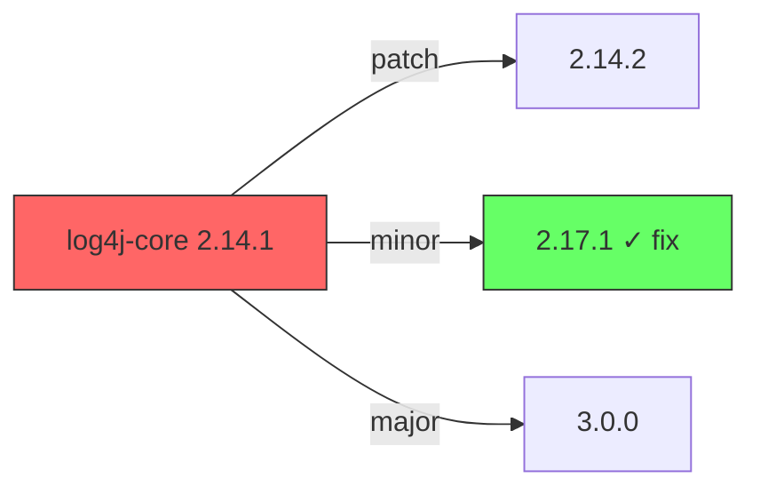

# Vulnetix Fix Intelligence Skill

This skill fetches fix intelligence for a vulnerability and proposes concrete, actionable remediation steps for the current repository.

## Output & Analysis Guidelines

**Primary output format:** Markdown. All reports, tables, fix options, version diffs, and verification summaries MUST be presented as formatted markdown text directly — never generate scripts or programs to produce output that can be expressed as markdown.

**Visual data — use Mermaid diagrams** to display data visually when it aids comprehension. Mermaid renders natively in markdown and requires no external tools. Use it for:
- Dependency upgrade paths → `graph LR` showing current → target version with breaking change annotations
- Fix option comparison → `quadrantChart` plotting Safe Harbour confidence vs. version change magnitude
- Dependency tree showing vulnerable path → `graph TD` (root → parent → vulnerable dep)
- Post-fix verification status → `flowchart` (scan → tests → result)

Example — upgrade path:
````markdown

````

**If `uv` is available**, richer visualizations can be generated with Python (matplotlib, plotly) and saved to `.vulnetix/`:
```bash
command -v uv &>/dev/null && uv run --with matplotlib python3 -c '
import matplotlib.pyplot as plt
# ... generate chart ...
plt.savefig(".vulnetix/chart.png", dpi=150, bbox_inches="tight")
'
```
When Python charts are generated, display them inline and keep the Mermaid version as a text fallback.

**Data processing — tooling cascade (strict order):**

1. **jq / yq + bash builtins** (preferred) — `jq` for JSON (API responses, CycloneDX SBOMs, package manager output), `yq` for YAML (memory file). Pipe to `head`, `tail`, `cut`, `sed`, `grep`, `sort`, `uniq`, `wc` for shaping.
2. **uv** (for complex analysis or charts) — If dependency graph analysis, version comparison logic, or visualization beyond Mermaid are needed, check `uv` first:
   ```bash
   command -v uv &>/dev/null && uv run --with pandas,matplotlib python3 -c '...'
   ```
3. **python3 stdlib** (last resort) — Only if `uv` is unavailable. Use `json`, `csv`, `collections`, `statistics` modules — **no pip dependencies**:
   ```bash
   command -v python3 &>/dev/null && python3 -c 'import json, sys; ...'
   ```

**Never assume any runtime is available** — always check with `command -v` before use. If all programmatic tools are unavailable, analyze manually with the Read tool and present results as markdown with Mermaid diagrams.

**Package manager commands** (`npm install --dry-run`, `pip show`, `go mod tidy`, `cargo check`, etc.) are exempt — they are executed directly as part of the fix workflow, not for data analysis.

## Mandatory Reporting Requirements

**Every output and report from this skill MUST include the following version and provenance information for each affected package:**

### Package Version Reporting

All reports MUST display:

| Field | Description | Required |
|-------|-------------|----------|
| **Current Version** | The version currently installed/resolved | Always |
| **Version Source** | How the version was determined (see below) | Always |
| **Fix Target Version** | The patched version to upgrade to | When available |
| **Fix Source** | Registry, distro patch, or source commit hash | Always |
| **Safe Harbour Confidence** | Confidence score 0.00–1.00 (see below) | Always |

### Version Source Transparency

You MUST be transparent about how the current version was determined. Report one of:

- **User-supplied** — the user provided the version directly
- **Manifest** — read from a package manager manifest file (state which file)
- **Lockfile** — read from a lockfile (state which file)
- **Installed** — derived from the installed package on the filesystem:
  - npm/node: read `node_modules/<pkg>/package.json` (search parent directories too)
  - Python: run `pip show <pkg>` or read `site-packages/<pkg>/METADATA`
  - Go: read `go.sum` or run `go list -m <pkg>`
  - Rust: read `Cargo.lock` or run `cargo metadata`
  - System binaries: run `<binary> --version` or check `PATH` resolution
  - Ruby: run `gem list <pkg>` or read `Gemfile.lock`
  - Maven: read effective POM or local `.m2` cache
- **Context** — the version was already present in conversation context
- **Unknown** — version could not be determined (explain why)

If the user does not supply the version and it is not in conversation context, you MUST attempt to derive it from the filesystem before reporting "Unknown". Search outside the current working directory if needed — check parent directories, global package manager directories, and gitignored directories (e.g., `node_modules/`, `vendor/`, `.venv/`, `target/`, `__pycache__/`).

### Safe Harbour Confidence Score

Express the Safe Harbour score as a decimal between 0.00 and 1.00 where 1.00 = 100% confidence the fix resolves the vulnerability without introducing regressions or breaking changes.

**Confidence tiers:**
- **High confidence (> 0.90):** Patch-level bump in the same minor version, official registry release, well-tested fix, minimal API surface change
- **Reasonable confidence (0.35–0.90):** Minor version bump, distro-repackaged patch, source fix from upstream with commit hash, some API changes but backward-compatible
- **Low confidence (< 0.35):** Major version bump, unofficial patch, cherry-picked commit from development branch, significant API changes, no upstream release yet

**What factors adjust confidence:**
- Registry-published release with changelog: +0.15
- Distro-maintained patch (e.g., Debian, Ubuntu, RHEL): +0.10
- Upstream commit hash verified in release tag: +0.10
- CISA KEV listed (validated exploitation): +0.05 (urgency signal, not fix quality)
- Major version jump: −0.25
- No test suite in project to validate: −0.15
- Transitive dependency (indirect control): −0.10
- Built from source with untagged commit: −0.20

**Report format for each affected package:**

```
Package: <name>
Current Version: <version> (source: <version-source>)
Fix Target: <version> (source: <registry|distro <name> <version>|commit <hash>>)
Safe Harbour: <score> (<High|Reasonable|Low> confidence)
```

## Vulnerability Memory File (.vulnetix/memory.yaml)

This skill maintains a `.vulnetix/memory.yaml` file in the repository root that tracks all vulnerability encounters, decisions, and fix outcomes across sessions. **You MUST read this file at the start of every invocation and update it after every action.**

### Schema

```yaml
# .vulnetix/memory.yaml
# Auto-maintained by Vulnetix Claude Code Plugin
# Do not remove — tracks vulnerability decisions, manifest scans, and fix history

schema_version: 1
manifests:                                # Tracked manifest files and SBOM scan history
  package.json:
    path: "package.json"                  # Relative path from repo root
    ecosystem: npm
    last_scanned: "2024-01-15T10:30:00Z"  # ISO 8601 UTC
    sbom_generated: true
    sbom_path: ".vulnetix/scans/package.json.20240115T103000Z.cdx.json"
    vuln_count: 3                         # Vulnerabilities found in last scan
    scan_source: hook                     # hook | fix | exploits | package-search
  services--api--go.mod:
    path: "services/api/go.mod"           # Supports monorepo paths (key uses -- separator)
    ecosystem: go
    last_scanned: "2024-01-15T10:31:00Z"
    sbom_generated: true
    sbom_path: ".vulnetix/scans/services--api--go.mod.20240115T103100Z.cdx.json"
    vuln_count: 0
    scan_source: hook
vulnerabilities:
  CVE-2021-44228:                       # Primary vuln ID (key)
    aliases:                             # Other IDs for the same vuln
      - GHSA-jfh8-c2jp-5v3q
    package: log4j-core
    ecosystem: maven
    discovery:
      date: "2024-01-15T10:30:00Z"      # ISO 8601 UTC
      source: manifest                   # manifest | lockfile | sbom | scan | user | hook
      file: pom.xml                      # The manifest where it was found
      sbom: .vulnetix/scans/pom.xml.cdx.json  # CycloneDX v1.7 SBOM (when produced by scan/hook)
    versions:
      current: "2.14.1"
      current_source: "lockfile: pom.xml"
      fixed_in: "2.17.1"
      fix_source: "registry: Maven Central"
    severity: critical                   # critical | high | medium | low | unknown
    safe_harbour: 0.82                   # 0.00–1.00 confidence score
    status: fixed                        # See VEX Status Mapping below
    justification: null                  # See VEX Justification Mapping below
    action_response: null                # See VEX Action Response Mapping below
    threat_model:                        # Populated by /vulnetix:exploits
      techniques: [T1190, T1059]         # MITRE ATT&CK IDs (internal only)
      tactics:                           # Developer-friendly descriptions (shown to user)
        - "Attackable from the internet"
        - "Can run arbitrary commands"
      attack_vector: network             # network | local | adjacent | physical
      attack_complexity: low             # low | high
      privileges_required: none          # none | low | high
      user_interaction: none             # none | required
      reachability: direct               # direct | transitive | not-found | unknown
      exposure: public-facing            # public-facing | internal | local-only | unknown
    cwss:                                # CWSS-derived priority (populated by /vulnetix:exploits)
      score: 87.5                        # 0-100 composite priority score
      priority: P1                       # P1 | P2 | P3 | P4
      factors:
        technical_impact: 100            # 0-100
        exploitability: 95               # 0-100
        exposure: 100                    # 0-100
        complexity: 90                   # 0-100
        repo_relevance: 70               # 0-100
    pocs:                                # PoC sources (from /vulnetix:exploits, never executed)
      - url: "https://exploit-db.com/exploits/12345"
        source: exploitdb
        type: poc
        local_path: ".vulnetix/pocs/CVE-2021-44228/exploit_12345.py"
        fetched_date: "2024-01-15T10:35:00Z"
        verified: true
        analysis: "RCE via JNDI lookup, network vector, no auth"
    dependabot:                          # Populated from GitHub Dependabot via gh CLI
      alert_number: 42                   # Dependabot alert number on this repo
      alert_state: fixed                 # open | dismissed | fixed | auto_dismissed
      alert_url: "https://github.com/owner/repo/security/dependabot/42"
      dismiss_reason: null               # fix_started | inaccurate | no_bandwidth | not_used | tolerable_risk | null
      dismiss_comment: null              # Dismisser's comment, if any
      pr_number: 187                     # Associated Dependabot PR number, or null
      pr_state: merged                   # open | closed | merged | null
      pr_url: "https://github.com/owner/repo/pull/187"
      pr_latest_comment: "LGTM, merging" # Last comment on the PR (for context)
      last_checked: "2024-01-15T10:30:00Z"
    code_scanning:                       # Populated from GitHub CodeQL / code scanning via gh CLI
      alerts:                            # CodeQL alerts correlated to this vuln (matched by CWE)
        - alert_number: 15
          state: dismissed               # open | dismissed | fixed
          rule_id: "java/log4j-injection"
          rule_name: "Log4j injection"
          severity: critical             # critical | high | medium | low | warning | note | error
          dismissed_reason: null         # "false positive" | "won't fix" | "used in tests" | null
          dismissed_comment: null        # Free-text justification (max 280 chars)
          dismissed_by: "octocat"        # GitHub username
          file_path: "src/main/java/App.java"
          start_line: 42
          url: "https://github.com/owner/repo/security/code-scanning/15"
      tool: CodeQL                       # CodeQL | semgrep | etc.
      tool_version: "2.15.0"
      last_checked: "2024-01-15T10:30:00Z"
    secret_scanning:                     # Populated from GitHub secret scanning via gh CLI
      alerts:                            # Secret scanning alerts correlated to this vuln's package/context
        - alert_number: 7
          state: resolved                # open | resolved
          secret_type: "github_personal_access_token"
          secret_type_display: "GitHub Personal Access Token"
          resolution: revoked            # false_positive | wont_fix | revoked | used_in_tests | null
          resolution_comment: "Token rotated and old one revoked"
          resolved_by: "octocat"
          validity: inactive             # active | inactive | unknown
          file_path: "config/settings.py"
          url: "https://github.com/owner/repo/security/secret-scanning/7"
          push_protection_bypassed: false
      last_checked: "2024-01-15T10:30:00Z"
    decision:
      choice: fix-applied                # See User Decision Values below
      reason: "Upgraded to 2.17.1 via version bump"
      date: "2024-01-15T11:00:00Z"
    history:                             # Append-only event log
      - date: "2024-01-15T10:30:00Z"
        event: discovered
        detail: "Found via /vulnetix:fix CVE-2021-44228"
      - date: "2024-01-15T11:00:00Z"
        event: fix-applied
        detail: "Version bumped log4j-core 2.14.1 → 2.17.1 in pom.xml"
```

### VEX Status Mapping (Internal → Developer Language)

Use VEX semantics internally but **always communicate to the user in developer-friendly language**. Never use raw VEX terminology with the user.

| VEX Status | Developer Language | When to use |
|---|---|---|
| `not_affected` | **Not affected** — this vuln doesn't apply to your project | Package not present, code path unreachable, or already mitigated |
| `affected` | **Vulnerable** — your project is exposed, action needed | Package is present at a vulnerable version |
| `fixed` | **Fixed** — a fix has been applied | Version bumped, patch applied, or dependency removed |
| `under_investigation` | **Investigating** — still evaluating the impact | User hasn't decided yet, or analysis is ongoing |

### VEX Justification Mapping (for `not_affected` status)

| VEX Justification | Developer Language | Example |
|---|---|---|
| `component_not_present` | **Package not in this project** | Manifest search found no match |
| `vulnerable_code_not_reachable` | **Vulnerable code path not used** | App imports only safe submodules |
| `vulnerable_code_cannot_be_controlled_by_adversary` | **Not exploitable in this deployment** | Internal-only service, no untrusted input |
| `inline_mitigations_already_exist` | **Already mitigated** | WAF rule, input validation, or config hardening in place |

### VEX Action Response Mapping (for `affected` status)

| VEX Action | Developer Language | When to use |
|---|---|---|
| `will_not_fix` | **Risk accepted** — won't fix, documented reason | User explicitly accepts the risk |
| `will_fix` | **Fix planned** — scheduled for later | User wants to fix but not right now |
| `update` | **Updating** — fix in progress | Actively applying a version bump or patch |

### User Decision Values

These are the `decision.choice` values recorded in the memory file, mapped from user feedback:

| Decision | Maps to VEX | Triggered by user saying |
|---|---|---|
| `fix-applied` | status: `fixed` | "Yes, apply the fix" / fix was successfully applied |
| `risk-accepted` | status: `affected`, action: `will_not_fix` | "We'll accept this risk" / "Won't fix" |
| `not-affected` | status: `not_affected` | "This doesn't affect us" / "Not relevant" |
| `investigating` | status: `under_investigation` | "Let me look into this" / "Need more info" |
| `deferred` | status: `affected`, action: `will_fix` | "We'll fix this later" / "Not now" |
| `mitigated` | status: `not_affected`, justification: `inline_mitigations_already_exist` | "We have a workaround" / "Already handled" |
| `inlined` | status: `fixed` | Dependency was replaced with first-party code |
| `risk-avoided` | status: `not_affected`, justification: `component_not_present` | "We removed the dependency" / "Feature disabled" / "Not deploying this" |
| `risk-transferred` | status: `not_affected`, justification: `vulnerable_code_cannot_be_controlled_by_adversary` | "Our WAF handles it" / "Platform mitigates this" / "Handled by infrastructure" |

### Dependabot Integration

When `gh` CLI is available, check GitHub Dependabot alerts and PRs for additional context. Dependabot state is a **supplementary signal** — it does not override user decisions recorded in the memory file, but it enriches context.

#### Checking gh CLI Availability

```bash
gh auth status 2>/dev/null
```

If this succeeds, the user has `gh` authenticated and you can query Dependabot. If it fails, skip Dependabot checks silently — do not prompt the user to authenticate.

#### Querying Dependabot Alerts

```bash
# Get the repo owner/name from git remote
gh api repos/{owner}/{repo}/dependabot/alerts --jq '[.[] | select(.security_advisory.cve_id == "'"$ARGUMENTS"'" or (.security_advisory.ghsa_id == "'"$ARGUMENTS"'") or (.security_advisory.identifiers[]? | select(.type == "CVE" and .value == "'"$ARGUMENTS"'") ) )] | first'
```

If the vuln ID is a GHSA, also match on `.security_advisory.ghsa_id`. If the vuln ID is a CVE, match on `.security_advisory.cve_id` and the identifiers array.

If no alert matches the exact vuln ID, also try aliases from the memory file entry.

#### Querying Dependabot PRs

```bash
# Find Dependabot PRs referencing this vulnerability or the affected package
gh pr list --author "app/dependabot" --state all --json number,title,state,url,comments --limit 50 | jq '[.[] | select(.title | test("'"$PACKAGE_NAME"'"; "i"))]'
```

For each matching PR, extract:
- PR number, state (open/closed/merged), URL
- The **latest comment** (last item in `.comments[]`): `gh pr view <number> --json comments --jq '.comments[-1].body'`

#### Dependabot Alert State → VEX Mapping

Map Dependabot states to VEX status and user decision values. **Always communicate to the user in developer-friendly language.**

| Dependabot Alert State | Dismiss Reason | VEX Status | Decision Choice | Developer Language |
|---|---|---|---|---|
| `open` | — | `under_investigation` | `investigating` | "Dependabot flagged this — still open, no action taken yet" |
| `dismissed` | `fix_started` | `affected` | `deferred` | "Dependabot dismissed — team started a fix" |
| `dismissed` | `inaccurate` | `not_affected` | `not-affected` | "Dependabot dismissed — team determined this is inaccurate" |
| `dismissed` | `no_bandwidth` | `affected` | `deferred` | "Dependabot dismissed — deferred, no bandwidth" |
| `dismissed` | `not_used` | `not_affected` | `not-affected` | "Dependabot dismissed — vulnerable code not used" |
| `dismissed` | `tolerable_risk` | `affected` | `risk-accepted` | "Dependabot dismissed — risk accepted as tolerable" |
| `fixed` | — | `fixed` | `fix-applied` | "Dependabot reports this as fixed" |
| `auto_dismissed` | — | `not_affected` | `not-affected` | "Dependabot auto-dismissed — no longer applicable" |

**When a Dependabot PR exists:**

| PR State | VEX Interpretation | Developer Language |
|---|---|---|
| `open` | `affected` + `will_fix` | "Dependabot PR #N is open — the team is working on this upgrade" |
| `merged` | `fixed` | "Dependabot PR #N was merged — fix applied via Dependabot" |
| `closed` (not merged) | Check latest PR comment for reason | "Dependabot PR #N was closed without merging — <reason from comments>" |

**For closed (not merged) PRs:** Read the latest comment on the PR to derive the justification. Common patterns:
- "superseded by ..." / "replaced by ..." → decision: `deferred`, reason: paraphrase the comment
- "not needed" / "false positive" → decision: `not-affected`, reason: paraphrase the comment
- "will handle manually" → decision: `deferred`, reason: "Team will handle manually"
- "breaking changes" / "can't upgrade" → decision: `deferred`, reason: paraphrase the comment
- No comments or unclear → decision: `investigating`, reason: "Dependabot PR closed without explanation"

#### When Dependabot and Memory File Disagree

If the memory file has a user decision but Dependabot shows a different state:
- **User decision takes precedence** — it represents a deliberate human choice
- **Flag the discrepancy** to the user: "Note: Dependabot shows this as <state>, but you previously marked it as <decision>. The Dependabot state may be out of sync."
- **Update the `dependabot` section** in the memory file to reflect current Dependabot state regardless — it's a factual record of what GitHub shows

### Code Scanning (CodeQL) Integration

When `gh` CLI is available, query GitHub code scanning alerts for findings that correlate with the current vulnerability. CodeQL alerts are correlated by **CWE match** — if the vulnerability's CWE (from VDB data) matches a CodeQL rule's tags or the rule directly references the vulnerability.

#### Querying Code Scanning Alerts

```bash
# List all open code scanning alerts
gh api repos/{owner}/{repo}/code-scanning/alerts?state=open --jq '[.[] | select(.rule.tags[]? | test("cwe-"; "i"))]'

# Check for alerts matching a specific CWE (extracted from vuln context in Step 2)
gh api repos/{owner}/{repo}/code-scanning/alerts --jq '[.[] | select(.rule.tags[]? | test("CWE-<NUMBER>"; "i"))]'

# Also check dismissed and fixed alerts for prior decisions
gh api repos/{owner}/{repo}/code-scanning/alerts?state=dismissed --jq '[.[] | select(.rule.tags[]? | test("CWE-<NUMBER>"; "i"))]'
gh api repos/{owner}/{repo}/code-scanning/alerts?state=fixed --jq '[.[] | select(.rule.tags[]? | test("CWE-<NUMBER>"; "i"))]'
```

If the repository does not have code scanning enabled, these calls return 403 or 404 — skip silently.

#### Checking Default Setup Status

```bash
gh api repos/{owner}/{repo}/code-scanning/default-setup --jq '{state, languages, query_suite}'
```

If `state` is `not-configured`, note this to the user: "CodeQL is not enabled on this repository. Consider enabling it to catch similar issues in code."

#### Code Scanning Alert State → VEX Mapping

| Code Scanning State | Dismissed Reason | VEX Status | Decision Choice | Developer Language |
|---|---|---|---|---|
| `open` | — | `under_investigation` | `investigating` | "CodeQL flagged this pattern — still open" |
| `dismissed` | `false positive` | `not_affected` | `not-affected` | "CodeQL alert dismissed — false positive" |
| `dismissed` | `won't fix` | `affected` | `risk-accepted` | "CodeQL alert dismissed — risk accepted" |
| `dismissed` | `used in tests` | `not_affected` | `not-affected` | "CodeQL alert dismissed — only in test code" |
| `fixed` | — | `fixed` | `fix-applied` | "CodeQL reports the code pattern is fixed" |

**Enriching vulnerability context with CodeQL findings:**

When a CodeQL alert matches the vulnerability's CWE:
- The `most_recent_instance.location` tells you **exactly which file and line** the vulnerable pattern appears — include this in the fix report
- The `rule.full_description` provides CodeQL's analysis of the weakness — quote relevant parts
- If multiple instances exist, list the affected files so the user knows everywhere the pattern occurs
- If the alert is `fixed`, this is strong evidence the code-level vulnerability has been addressed (complements a dependency version bump)
- Use `dismissed_comment` as the justification text when surfacing prior decisions

#### Autofix Integration (CodeQL AI Suggestions)

If a CodeQL alert has an autofix available, check its status:

```bash
gh api repos/{owner}/{repo}/code-scanning/alerts/{alert_number}/autofix --jq '{status}'
```

| Autofix Status | What to tell the user |
|---|---|
| `success` | "CodeQL has an AI-suggested fix for this code pattern — review it on GitHub" |
| `pending` | "CodeQL is generating an AI fix suggestion — check back later" |
| `error` | "CodeQL autofix failed for this alert" |
| `outdated` | "CodeQL's autofix is outdated — the code has changed since it was generated" |

If autofix status is `success`, suggest the user review it alongside any dependency fix — code-level fixes and dependency upgrades are complementary.

### Secret Scanning Integration

When `gh` CLI is available, query GitHub secret scanning alerts. Secret scanning findings relate to vulnerability management when:
- A leaked secret could be used to exploit the vulnerability (e.g., leaked API key + RCE = worse impact)
- The vulnerability is in credential handling code (CWE-798, CWE-321, CWE-259)
- The fix involves rotating secrets that may have been exposed

#### Querying Secret Scanning Alerts

```bash
# List all open secret scanning alerts
gh api repos/{owner}/{repo}/secret-scanning/alerts?state=open

# List resolved alerts (to check for prior decisions)
gh api repos/{owner}/{repo}/secret-scanning/alerts?state=resolved
```

If the repository does not have secret scanning enabled, these calls return 403 or 404 — skip silently.

**Correlation with vulnerability context:**
- If the vulnerability's CWE relates to credential handling (CWE-798 hard-coded credentials, CWE-321 hard-coded cryptographic key, CWE-259 hard-coded password, CWE-200 information exposure), check for secret scanning alerts in the same files
- If the vulnerable package handles authentication/secrets (e.g., `jsonwebtoken`, `bcrypt`, `passport`, `oauth2`), check for leaked secrets that might need rotation after fixing

#### Secret Scanning Alert State → VEX Mapping

| Secret Scanning State | Resolution | VEX Status | Decision Choice | Developer Language |
|---|---|---|---|---|
| `open` | — | `under_investigation` | `investigating` | "Exposed secret detected — still open, needs rotation" |
| `resolved` | `revoked` | `fixed` | `fix-applied` | "Secret was rotated and old one revoked" |
| `resolved` | `false_positive` | `not_affected` | `not-affected` | "Secret alert dismissed — false positive" |
| `resolved` | `wont_fix` | `affected` | `risk-accepted` | "Secret alert dismissed — risk accepted" |
| `resolved` | `used_in_tests` | `not_affected` | `not-affected` | "Secret alert dismissed — only used in test fixtures" |
| `resolved` | `pattern_edited` | `not_affected` | `not-affected` | "Secret scanning pattern was updated — no longer matches" |
| `resolved` | `pattern_deleted` | `not_affected` | `not-affected` | "Secret scanning pattern was removed" |

**Push protection context:**
If `push_protection_bypassed` is `true`, note this to the user — it means someone deliberately pushed a secret past GitHub's push protection. Include the bypasser's username and their comment (if any) for audit trail:
```
Secret push protection was bypassed by <user>: "<comment>"
```

**Secret validity:**
If `validity` is `active`, flag urgently: "This secret is still active — rotate it immediately." If `inactive`, note: "Secret has been deactivated." If `unknown`, note: "Secret validity could not be verified — recommend rotating as a precaution."

#### When GHAS and Memory File Disagree

Same principle as Dependabot:
- **User decision takes precedence** over GitHub alert state
- **Flag discrepancies** to the user
- **Always update** the `code_scanning` and `secret_scanning` sections to reflect current GitHub state — they are factual records

### Reading and Interpreting Prior State

When the memory file contains an entry for the current vuln ID (or any of its aliases):

1. **Show the user what's known** — previous status, decision, and when it was last updated
2. **Show GitHub security context** — surface all available GHAS data:
   - Dependabot: "Dependabot alert #N: <state>. PR #N: <state>."
   - CodeQL: "CodeQL alert #N (<rule_id>): <state> in <file>:<line>"
   - Secret scanning: "Secret scanning alert #N (<secret_type>): <state>, validity: <active|inactive|unknown>"
3. **Highlight changes** — if the vulnerability context has changed (new severity, new fix available, CISA KEV listing added, any GHAS alert state changed), flag this to the user
4. **Respect prior decisions** — if the user previously marked a vuln as "Risk accepted" or "Not affected", remind them of that decision and ask if they want to reassess rather than re-proposing the same fix
5. **Update, don't duplicate** — update the existing entry rather than creating a new one

## Workflow

### Step 0: Load Vulnerability Memory and Prior SBOMs

Before anything else:

**0a. Load memory file:**
1. Use **Glob** to search for `.vulnetix/memory.yaml` in the repo root
2. If it exists, use **Read** to load it
3. Check if the current vuln ID (from `$ARGUMENTS`) or any known aliases appear in the file
4. If a prior entry exists:
   - Display to the user: `Previously seen: <vulnId> — Status: <developer-friendly status> (as of <date>). Reason: <decision reason>`
   - If `cwss` data exists from a prior `/vulnetix:exploits` analysis, display: `Priority: <P1/P2/P3/P4> (<score>) — "<priority description>"` and use the threat model context to inform fix urgency.
   - If status is `fixed` and no new information contradicts it, confirm the fix is still in place by checking the current installed version. If the version has regressed, update the status to `affected` and proceed with the fix workflow.
   - If status is `risk-accepted` or `not-affected`, ask: "You previously marked this as <status>. Has anything changed, or would you like to reassess?"
   - If status is `investigating` or `deferred`, proceed with the fix workflow and note this is a follow-up.
   - If the entry has a `discovery.sbom` path, read that CycloneDX file for additional context (affected components, version ranges, severity ratings from the original scan).
5. If no prior entry exists, proceed normally — a new entry will be created in Step 8.

**0b. Check for existing CycloneDX SBOMs:**
1. Use **Glob** for `.vulnetix/scans/*.cdx.json`
2. If SBOMs exist, scan them for the current vuln ID — this provides pre-existing context about which manifests surfaced this vulnerability and what component versions were scanned
3. Reference the SBOM path in the memory entry's `discovery.sbom` field when creating or updating entries

**0c. Check Dependabot via gh CLI:**
1. Run `gh auth status 2>/dev/null` — if it fails, skip this step silently
2. If `gh` is available, query Dependabot alerts for this vuln ID (see "Querying Dependabot Alerts" above)
3. If a matching alert is found:
   - Display to the user: `Dependabot alert #<N>: <developer-friendly state>` (using the mapping table)
   - If a Dependabot PR exists, display: `Dependabot PR #<N>: <state>` with the latest comment summary
   - If the alert is `dismissed` or `fixed`, show the reason
4. If the memory file already has a `dependabot` section for this vuln, compare with current GitHub state and flag any changes: `"Dependabot state changed: <old> → <new>"`
5. Update the `dependabot` section in the memory entry with current state (will be persisted in Step 8)
6. Use Dependabot context to inform fix urgency:
   - Open alert + open PR → "A Dependabot upgrade PR already exists — consider reviewing and merging PR #N instead of manual fix"
   - Open alert + no PR → proceed with normal fix workflow
   - Open alert + closed PR → check PR comments for context on why it was closed — inform fix approach accordingly

**0d. Check Code Scanning (CodeQL) via gh CLI:**
1. Skip if `gh` auth failed in 0c
2. Extract the CWE ID from the vulnerability context (fetched in Step 2, but pre-check here if the memory file already has `threat_model` data or known CWE from prior analysis)
3. Query code scanning alerts matching the CWE:
   ```bash
   gh api repos/{owner}/{repo}/code-scanning/alerts --jq '[.[] | select(.rule.tags[]? | test("CWE-<NUMBER>"; "i"))]'
   ```
4. If CodeQL alerts are found:
   - Display: `CodeQL alert #<N> (<rule_id>): <state> in <file>:<line>` for each
   - If any alert is `dismissed`, show the reason and comment
   - If any alert has autofix status `success`, note: "CodeQL has an AI-suggested fix available"
5. Check default setup status to inform the user if CodeQL is not enabled:
   ```bash
   gh api repos/{owner}/{repo}/code-scanning/default-setup --jq '.state'
   ```
   If `not-configured`, note: "CodeQL is not enabled on this repo — consider enabling it for ongoing code-level detection of this weakness class"
6. If the memory file has a prior `code_scanning` section, compare alert states and flag changes
7. Store CodeQL findings for persistence in Step 8

**0e. Check Secret Scanning via gh CLI:**
1. Skip if `gh` auth failed in 0c
2. Determine if secret scanning is relevant to this vulnerability:
   - Check if the CWE relates to credential handling (CWE-798, CWE-321, CWE-259, CWE-200, CWE-522, CWE-256)
   - Check if the affected package handles authentication/secrets
3. If relevant, query secret scanning alerts:
   ```bash
   gh api repos/{owner}/{repo}/secret-scanning/alerts?state=open
   ```
4. If alerts are found in files that overlap with the vulnerability's affected code:
   - Display: `Secret scanning alert #<N> (<secret_type>): <state>, validity: <validity>`
   - If `validity` is `active`, flag urgently: "Active secret detected — rotate immediately, especially given this vulnerability"
   - If `push_protection_bypassed`, note the bypass for audit context
5. Also check resolved alerts for prior decisions:
   ```bash
   gh api repos/{owner}/{repo}/secret-scanning/alerts?state=resolved --jq '[.[] | select(.resolution != null)]'
   ```
6. If the memory file has a prior `secret_scanning` section, compare and flag state changes
7. Store secret scanning findings for persistence in Step 8

### Step 1: Fetch Fix Data

Run the Vulnetix VDB fixes command for both V1 and V2 endpoints:

```bash
vulnetix vdb fixes "$ARGUMENTS" -o json
vulnetix vdb fixes "$ARGUMENTS" -o json -V v2
```

**V1 response** (basic fixes):
```json
{
  "fixes": [
    {
      "type": "version",
      "package": "log4j-core",
      "ecosystem": "maven",
      "fixedIn": "2.17.1",
      "description": "Upgrade to patched version"
    }
  ]
}
```

**V2 response** (enhanced with registry, distro, source fixes):
```json
{
  "fixes": [
    {
      "type": "registry",
      "package": "log4j-core",
      "ecosystem": "maven",
      "fixedIn": "2.17.1",
      "registryUrl": "https://repo1.maven.org/...",
      "releaseDate": "2021-12-28"
    },
    {
      "type": "distro-patch",
      "distro": "ubuntu",
      "version": "20.04",
      "package": "liblog4j2-java",
      "patchVersion": "2.17.1-0ubuntu1",
      "aptCommand": "sudo apt-get install liblog4j2-java=2.17.1-0ubuntu1"
    },
    {
      "type": "source-fix",
      "commitUrl": "https://github.com/apache/logging-log4j2/commit/abc123",
      "patchUrl": "https://github.com/apache/logging-log4j2/commit/abc123.patch"
    }
  ]
}
```

### Step 2: Fetch Vulnerability Context

Get additional context about the vulnerability:

```bash
vulnetix vdb vuln "$ARGUMENTS" -o json
vulnetix vdb affected "$ARGUMENTS" -o json -V v2
```

Extract:
- **Affected package/product** names
- **Vulnerable version ranges** (e.g., `>=2.0.0, <2.17.1`)
- **CVSS/severity** (to assess urgency)
- **CISA KEV due date** (if applicable)

### Step 3: Analyze Repository Dependencies (Deep Filesystem Scan)

You MUST perform a thorough scan that goes beyond the current working directory. Search the entire project tree including gitignored directories.

#### 3a-pre: Check for Cached SBOMs

Before scanning, check the `manifests` section of `.vulnetix/memory.yaml` for recently scanned files. If a manifest was scanned by the pre-commit hook (or a prior skill invocation) within the last 24 hours (`last_scanned` timestamp), read the cached SBOM from `sbom_path` instead of re-scanning. This avoids redundant API calls. If the SBOM file is missing or stale, proceed with a fresh scan.

#### 3a: Find All Manifest and Lockfiles

Use **Glob** to find manifest files across the project, including monorepo structures:

```
**/package.json, **/package-lock.json, **/yarn.lock, **/pnpm-lock.yaml
**/requirements.txt, **/pyproject.toml, **/Pipfile, **/Pipfile.lock, **/poetry.lock, **/uv.lock
**/go.mod, **/go.sum
**/Cargo.toml, **/Cargo.lock
**/pom.xml, **/build.gradle, **/build.gradle.kts, **/gradle.lockfile
**/Gemfile, **/Gemfile.lock
**/composer.json, **/composer.lock
```

#### 3b: Derive Installed Versions from the Filesystem

**Do not rely solely on manifests.** Verify the actually-installed version by reading from package manager artifacts. These directories are typically gitignored — read them directly:

- **npm/node:** Read `node_modules/<package>/package.json` → `.version` field. Also check parent directories and workspace root `node_modules/`.
- **Python:** Run `pip show <package>` or read `.venv/lib/python*/site-packages/<package>/METADATA` or `__pycache__` dist-info directories.
- **Go:** Parse `go.sum` for exact hashes. Run `go list -m -json <package>` if go toolchain is available.
- **Rust:** Read `Cargo.lock` for exact resolved versions. Run `cargo metadata --format-version 1` if available.
- **Maven:** Check `~/.m2/repository/<groupPath>/<artifact>/` for cached JARs. Run `mvn dependency:tree` if available.
- **Ruby:** Read `Gemfile.lock` for resolved versions.
- **System binaries:** Run `which <binary>` then `<binary> --version` to determine installed version from `PATH`.

#### 3c: Determine Dependency Relationship

Use **Read** on each manifest and lockfile to determine:

1. **Is the vulnerable package installed?** (exact name match in manifest or lockfile)
2. **What version is installed?** (compare manifest, lockfile, AND filesystem-installed version — report all if they differ)
3. **Is it a direct or transitive dependency?** (present in manifest = direct; only in lockfile = transitive)
4. **What imports/requires are used from this package?** Use **Grep** to find all import/require/include statements referencing the vulnerable package across the codebase

If the package is **not found**, inform the user that the vulnerability may not affect this repository.

### Step 4: Evaluate Dependency Inlining (First-Party Replacement)

Before proposing a version bump, evaluate whether the dependency can be removed entirely:

**Criteria for inlining (ALL must be true):**
1. The affected third-party code is **open source** with a compatible license
2. The source is **publicly available online** (e.g., on GitHub, GitLab, crates.io source)
3. The portion of the library actually used by this application is **small** — assess by:
   - Counting how many functions/classes/modules from the package are imported
   - Estimating the lines of code for just those used parts (< ~200 lines is a good threshold)
4. The used functionality is **self-contained** (no deep internal dependency chain within the library)

**If inlining is viable:**
- Use **WebFetch** to retrieve the specific source file(s) from the upstream repository
- Extract only the functions/classes actually used by the application
- Preserve the original license attribution in a comment header
- Propose writing the extracted code as a first-party module (e.g., `lib/`, `internal/`, `utils/`)
- Show edits to update all import/require statements to point to the new first-party module
- Show edits to remove the dependency from all manifest and lockfiles

**Present this as Option A0 (highest priority) when the criteria are met,** above the standard Version Bump option.

### Step 5: Present Fix Options

Categorize fixes into 5 categories (A0-D) and present them in priority order. **Every option MUST include the Safe Harbour confidence score and all version details per the Mandatory Reporting Requirements above.**

---

#### **A0. Inline as First-Party Code** (Best — when viable)

If the inlining evaluation in Step 4 passed:

```
Package: <name>
Current Version: <version> (source: <version-source>)
Fix: Remove dependency entirely, inline <N> functions as first-party code
Safe Harbour: <score> (typically High — you own the code, no upstream risk)
License: <original license> (attribution preserved in source header)
```

**Action:** Write inlined module, update all imports, remove from manifests and lockfiles.

---

#### **A. Version Bump** (Preferred when inlining is not viable)

If a patched version is available in the registry:

| Current Version | Version Source | Target Version | Fix Source | Safe Harbour | Breaking Changes? | Manifest File |
|-----------------|---------------|----------------|------------|-------------|-------------------|---------------|
| 2.14.1 | Lockfile: pom.xml | 2.17.1 | Registry: Maven Central | 0.82 (Reasonable) | Minor API changes | pom.xml |

**Action:** Update dependency version in manifest file.

**Risk assessment:**
- **Patch version** (2.14.1 → 2.14.2): Low risk, backward compatible
- **Minor version** (2.14.x → 2.15.0): Medium risk, check changelog
- **Major version** (2.x → 3.0): High risk, breaking changes expected

---

#### **B. Patch** (Alternative)

If a source patch or distro patch is available:

| Patch Source | Type | Commit/Version | Safe Harbour | Applicability |
|--------------|------|----------------|-------------|---------------|
| GitHub commit `abc123` | Source fix | `abc123` | 0.55 (Reasonable) | Can be applied to local fork |
| Ubuntu 20.04 | Distro patch | `2.17.1-0ubuntu1` | 0.75 (Reasonable) | Only if running on Ubuntu |

**Action:** Download patch and apply to local dependency copy (advanced users only).

---

#### **C. Workaround** (Temporary Mitigation)

If no fix is available yet, provide temporary mitigations:

- **Configuration changes** (disable vulnerable feature, enable safeguards)
- **Input validation** (sanitize untrusted input)
- **Network isolation** (firewall rules, rate limiting)
- **Vendor-recommended workarounds** (from advisory)
- **Selective imports** — refactor imports to avoid loading the vulnerable code path (see Step 7)

**Action:** Apply configuration changes to relevant files.

---

#### **D. Advisory Guidance** (Informational)

- **Vendor advisory links** (official fix documentation)
- **CISA KEV due date** (if listed, agencies must patch by this date)
- **Community discussion** (GitHub issues, Stack Overflow)

**Action:** No immediate action, but monitor for updates.

---

### Step 6: Apply Fixes Immediately

After presenting the options, **immediately begin applying the preferred fix** (do not wait for a planning interview unless the situation is ambiguous). Apply changes in this order:

#### 6a: Back Up Lockfiles and Manifests for Rollback

Before making any changes, preserve the current state so the user can roll back:

```bash
# Copy lockfiles and manifests to a backup location
cp package-lock.json package-lock.json.vulnetix-backup 2>/dev/null
cp yarn.lock yarn.lock.vulnetix-backup 2>/dev/null
cp pom.xml pom.xml.vulnetix-backup 2>/dev/null
# ... for each relevant file
```

Inform the user that backups have been created and how to restore them.

#### 6b: Update Package Manager Manifests

Use **Edit** to update version constraints in all affected manifest files. Handle version locking and conflicts:

- **npm:** If `package-lock.json` pins a conflicting version, update both `package.json` and consider running `npm install` to regenerate the lockfile
- **Python (pip):** Update `requirements.txt` version pins. If using `pip-compile` / `pip-tools`, update `.in` files
- **Python (poetry):** Update `pyproject.toml` version constraints
- **Go:** Update `go.mod` require directives
- **Rust:** Update `Cargo.toml` version constraints. Handle workspace-level version overrides in `[patch]` section
- **Maven:** Update `<version>` in `pom.xml`. Handle BOM (Bill of Materials) version management in parent POMs
- **Gradle:** Update version in `build.gradle` or version catalog

**Dependency resolution overrides:** When version conflicts exist (e.g., another dependency pins the vulnerable version), apply package manager-specific override mechanisms:
- **npm:** `overrides` field in `package.json`
- **yarn:** `resolutions` field in `package.json`
- **pnpm:** `pnpm.overrides` in `package.json`
- **pip:** constraint files or direct pins
- **Maven:** `<dependencyManagement>` section or `<exclusions>`
- **Cargo:** `[patch]` section in `Cargo.toml`

#### 6c: Refactor Imports to Minimize Attack Surface

Use **Grep** to find all import/require/include statements for the vulnerable package. Where possible, refactor to import only the specific submodules or functions needed rather than the entire package:

**JavaScript/TypeScript:**
```diff
- import lodash from 'lodash'
+ import get from 'lodash/get'
+ import set from 'lodash/set'
```

**Python:**
```diff
- import cryptography
+ from cryptography.hazmat.primitives.ciphers import Cipher, algorithms, modes
```

**Java:**
```diff
- import org.apache.commons.collections.*;
+ import org.apache.commons.collections.CollectionUtils;
```

**Go:**
```diff
// Go imports are already module-path scoped — check if a subpackage can be used instead
- import "github.com/example/biglib"
+ import "github.com/example/biglib/subpkg"
```

This reduces the attack surface by not loading vulnerable code paths that the application never uses.

#### 6d: Dry-Run Package Manager to Verify

After editing manifests, run the package manager in dry-run or check mode to verify the dependency resolution succeeds without actually modifying `node_modules/` or equivalents:

```bash
# npm
npm install --dry-run

# yarn
yarn install --check-files

# pnpm
pnpm install --dry-run

# pip
pip install --dry-run -r requirements.txt

# go
go mod tidy -v  # prints what it would change

# cargo
cargo check

# maven
mvn dependency:resolve -DdryRun

# composer
composer install --dry-run
```

If the dry run fails (e.g., version conflict, missing package), diagnose the issue and either:
1. Adjust version constraints to resolve the conflict
2. Apply a dependency override (see 6b)
3. Report the conflict to the user with suggested alternatives

If the dry run succeeds, inform the user that the fix resolves cleanly.

#### 6e: Restore on Failure

If any step fails and the fix cannot be completed, restore from backups:

```bash
mv package-lock.json.vulnetix-backup package-lock.json 2>/dev/null
# ... for each backed-up file
```

Inform the user what failed and why, and suggest alternative approaches.

### Step 7: Post-Fix Verification

After applying fixes:

1. **Run tests** (identify test command from manifest and run it):
```bash
npm test             # npm
pytest               # Python
go test ./...        # Go
cargo test           # Rust
mvn test             # Maven
```

2. **Re-scan for the vulnerability and persist the CycloneDX SBOM:**
```bash
mkdir -p .vulnetix/scans
vulnetix scan --file <manifest> -f cdx17 > .vulnetix/scans/<sanitized-manifest>.cdx.json
```
   - Use the same naming convention as the pre-commit hook: replace `/` with `--` in the manifest path
   - This overwrites any prior SBOM for the same manifest, so `.vulnetix/scans/` always has the latest scan
   - Update the `discovery.sbom` field in `.vulnetix/memory.yaml` to point to this file

3. **Report results** including all version details:
```
Fix Applied:
  Package: <name>
  Previous Version: <old> (source: <how determined>)
  New Version: <new> (source: <registry|distro|commit>)
  Safe Harbour: <score> (<tier> confidence)
  Verification: <scan passed|scan still flags|tests passed|tests failed>
  Rollback: <backup files created at ...>
```

If the scan still shows the vulnerability, explain that it may be a transitive dependency and suggest:
- Using dependency update tools (`npm audit fix`, `cargo update`, etc.)
- Manually updating the parent dependency that pulls in the vulnerable package
- Checking if a newer version of the parent dependency exists
- Applying dependency overrides (see Step 6b)

### Step 8: Update Vulnerability Memory

After **every** action in this skill — whether a fix was applied, the user made a decision, or new information was discovered — update `.vulnetix/memory.yaml`.

#### 8a: Create or Update the Entry

Use **Read** to load the current file (if it exists), then use **Write** to update it. If the file does not exist, create it with the `schema_version: 1` header.

**On first discovery** (no prior entry for this vuln ID):
```yaml
  <VULN_ID>:
    aliases: [<any known aliases from VDB response>]
    package: <package name>
    ecosystem: <ecosystem>
    discovery:
      date: "<current ISO 8601 UTC timestamp>"
      source: <manifest|lockfile|sbom|scan|user|hook>
      file: <file where found, or null>
      sbom: <.vulnetix/scans/<manifest>.cdx.json, or null>
    versions:
      current: "<detected version>"
      current_source: "<how version was determined>"
      fixed_in: "<patched version, or null>"
      fix_source: "<registry|distro|commit hash, or null>"
    severity: <critical|high|medium|low|unknown>
    safe_harbour: <0.00-1.00>
    status: under_investigation
    justification: null
    action_response: null
    decision:
      choice: investigating
      reason: "Discovered via /vulnetix:fix"
      date: "<current timestamp>"
    history:
      - date: "<current timestamp>"
        event: discovered
        detail: "Found <package>@<version> in <file>"
```

**On fix applied:**
- Set `status: fixed`, `decision.choice: fix-applied`
- Update `versions.current` to the new version
- Append to `history`: `event: fix-applied`, detail: what was done

**On user decision** (interpret user feedback using VEX semantics):
- User says "won't fix" / "accept the risk" → `status: affected`, `action_response: will_not_fix`, `decision.choice: risk-accepted`
- User says "doesn't affect us" → `status: not_affected`, `decision.choice: not-affected`, set appropriate `justification`
- User says "we'll fix this later" → `status: affected`, `action_response: will_fix`, `decision.choice: deferred`
- User says "we have a workaround" → `status: not_affected`, `justification: inline_mitigations_already_exist`, `decision.choice: mitigated`
- User says "need more info" → `status: under_investigation`, `decision.choice: investigating`
- Dependency was inlined as first-party → `status: fixed`, `decision.choice: inlined`
- User says "we removed it" / "disabled that feature" → `status: not_affected`, `justification: component_not_present`, `decision.choice: risk-avoided`
- User says "our WAF handles it" / "platform mitigates this" → `status: not_affected`, `justification: vulnerable_code_cannot_be_controlled_by_adversary`, `decision.choice: risk-transferred`
- Always record the user's actual words in `decision.reason`
- Always append the decision to `history`

#### 8b: Preserve Decision Context

When recording a user decision, always capture:
- **What the user said** (verbatim or close paraphrase) as the `reason`
- **The current timestamp** as the `date`
- **Any qualifying context** (e.g., "accepted risk because this is an internal tool" or "deferring until after the v2.0 release")

#### 8c: Persist Dependabot State

If Dependabot data was gathered in Step 0c, write it to the `dependabot` section of the memory entry:
- `alert_number`, `alert_state`, `alert_url`
- `dismiss_reason`, `dismiss_comment` (if dismissed)
- `pr_number`, `pr_state`, `pr_url`, `pr_latest_comment` (if a PR exists)
- `last_checked`: current timestamp

If a Dependabot alert state change resulted in a VEX status update (e.g., alert moved from `open` to `fixed`), append to `history`: `event: dependabot-sync`, detail: `"Dependabot alert #N: <old state> → <new state>"`

**Do NOT change `status` or `decision` based on Dependabot alone** if the user has already made a deliberate decision. Only auto-update status from Dependabot if:
- No prior user decision exists (i.e., `decision.choice` is `investigating`)
- The Dependabot state is more definitive (e.g., `fixed` or `dismissed` with a clear reason)

#### 8d: Persist Code Scanning (CodeQL) State

If CodeQL data was gathered in Step 0d, write it to the `code_scanning` section of the memory entry:
- `alerts[]`: each correlated alert with `alert_number`, `state`, `rule_id`, `rule_name`, `severity`, `dismissed_reason`, `dismissed_comment`, `dismissed_by`, `file_path`, `start_line`, `url`
- `tool`, `tool_version`: from the alert's `tool` field
- `last_checked`: current timestamp

If a CodeQL alert state changed since the last check, append to `history`: `event: codeql-sync`, detail: `"CodeQL alert #N (<rule_id>): <old state> → <new state>"`

**Auto-update rules** (same principle as Dependabot):
- Only auto-update `status`/`decision` from CodeQL if no prior user decision exists
- A CodeQL `fixed` state is strong evidence the code-level issue is resolved — note in history but let user confirm
- A CodeQL `dismissed` with `dismissed_comment` provides justification context — record it but don't override user decisions

#### 8e: Persist Secret Scanning State

If secret scanning data was gathered in Step 0e, write it to the `secret_scanning` section of the memory entry:
- `alerts[]`: each correlated alert with `alert_number`, `state`, `secret_type`, `secret_type_display`, `resolution`, `resolution_comment`, `resolved_by`, `validity`, `file_path`, `url`, `push_protection_bypassed`
- `last_checked`: current timestamp

If a secret scanning alert state changed, append to `history`: `event: secret-scanning-sync`, detail: `"Secret scanning alert #N (<secret_type>): <old state> → <new state>"`

If a previously active secret is now `inactive` (revoked), note this as positive progress. If a previously unknown secret is now `active`, flag urgently.

#### 8f: Handle Aliases

If the VDB response reveals that this vuln ID has aliases (e.g., a CVE maps to a GHSA, or vice versa), update the `aliases` list. When checking for prior entries in Step 0, always check both the primary ID and all known aliases.

#### 8g: Update Manifests Section

If any manifest files were scanned during this fix workflow (Step 3 or Step 7), update the `manifests` section of `.vulnetix/memory.yaml`:
- For each scanned manifest: set `last_scanned` to current timestamp, `vuln_count` to the result, `scan_source: fix`
- If a new CycloneDX SBOM was generated, set `sbom_generated: true` and update `sbom_path`
- If a manifest was discovered that isn't already tracked, add a new entry with its `path`, `ecosystem`, and scan metadata
- Do not remove manifest entries added by the hook or other skills — only update or add

#### 8h: Clean Output

After writing the memory file, confirm to the user:
```
Vulnerability memory updated: <VULN_ID> — <developer-friendly status> (<reason summary>)
GitHub security sync: Dependabot <state>, CodeQL <N alerts>, Secret scanning <N alerts>
```

## Error Handling

- If `vulnetix vdb fixes` returns no results, inform the user that no official fix is available yet and suggest workarounds or monitoring. Still record the vuln in `.vulnetix/memory.yaml` with `status: under_investigation`.
- If the package is not found in the repository, confirm with the user whether it's a transitive dependency. Record as `status: not_affected`, `justification: component_not_present` if confirmed absent.
- If manifest format is complex (Gradle, multi-module Maven), ask the user which file to edit
- If breaking changes are expected, warn the user and recommend testing thoroughly
- If version cannot be determined from any source, report "Unknown" with an explanation and ask the user to provide it
- If dry-run fails, restore backups and report the conflict
- If `.vulnetix/memory.yaml` cannot be written (permissions, etc.), warn the user but do not block the fix workflow

## Security Notes

- **Always upgrade to the latest patched version** unless there are known regressions
- If a vulnerability has a **CISA KEV due date**, prioritize it as urgent
- For **critical/high severity** vulnerabilities, recommend immediate patching even if it requires major version bumps
- Never downgrade to an older version as a "fix" — this may introduce other vulnerabilities
- When inlining code, always preserve license attribution
- When refactoring imports, verify the reduced import set still covers all usages in the codebase via **Grep**

## Integration with Other Skills

- If exploits are known, suggest running `/vulnetix:exploits $ARGUMENTS` first to understand impact
- After fixing, suggest re-running `/vulnetix:package-search` if adding new dependencies as alternatives
- The `/vulnetix:exploits` and `/vulnetix:package-search` skills also read and contribute to `.vulnetix/memory.yaml` — decisions made in any skill are visible to all others
