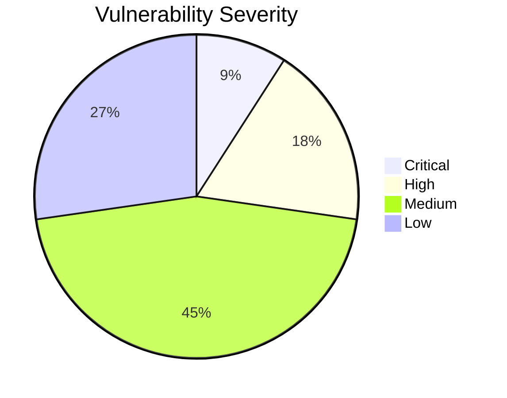

# Vulnetix Package Search Skill

This skill searches for packages across ecosystems and provides a comprehensive security risk assessment before adding them as dependencies.

## Output & Analysis Guidelines

**Primary output format:** Markdown. All reports, tables, summaries, and diffs MUST be presented as formatted markdown text directly — never generate scripts or programs to produce output that can be expressed as markdown.

**Visual data — use Mermaid diagrams** to display data visually when it aids comprehension. Mermaid renders natively in markdown and requires no external tools. Use it for:
- Dependency trees / upgrade paths → `graph TD` or `graph LR`
- Version comparison timelines → `timeline`
- Risk breakdowns → `pie` or `quadrantChart`
- Decision flow (add/skip/alternatives) → `flowchart`

Example — vulnerability distribution for a package:
````markdown

````

**If `uv` is available**, richer visualizations can be generated with Python (matplotlib, plotly) and saved to `.vulnetix/`:
```bash
command -v uv &>/dev/null && uv run --with matplotlib python3 -c '
import matplotlib.pyplot as plt
# ... generate chart ...
plt.savefig(".vulnetix/chart.png", dpi=150, bbox_inches="tight")
'
```
When Python charts are generated, display them inline and keep the Mermaid version as a text fallback.

**Data processing — tooling cascade (strict order):**

1. **jq / yq + bash builtins** (preferred) — `jq` for JSON, `yq` for YAML. Pipe to `head`, `tail`, `cut`, `sed`, `grep`, `sort`, `uniq`, `wc` for shaping.
2. **uv** (for complex analysis or charts) — If aggregation, statistics, or visualization beyond Mermaid are needed, check `uv` first:
   ```bash
   command -v uv &>/dev/null && uv run --with pandas,matplotlib python3 -c '...'
   ```
3. **python3 stdlib** (last resort) — Only if `uv` is unavailable. Use `json`, `csv`, `collections`, `statistics` modules — **no pip dependencies**:
   ```bash
   command -v python3 &>/dev/null && python3 -c 'import json, sys; ...'
   ```

**Never assume any runtime is available** — always check with `command -v` before use. If all programmatic tools are unavailable, analyze manually with the Read tool and present results as markdown with Mermaid diagrams.

**Version detection commands** (`pip show`, `go list -m`, `cargo pkgid`, etc.) are exempt — they query package managers directly and are tried as-available per the version detection priority in Step 1b.

## Vulnerability Memory (.vulnetix/memory.yaml)

This skill reads the `.vulnetix/memory.yaml` file in the repository root to surface prior vulnerability history for packages being searched. This file is shared with `/vulnetix:fix` and `/vulnetix:exploits`.

**At the start of every invocation:**
1. Use **Glob** to check if `.vulnetix/memory.yaml` exists in the repo root
2. If it exists, use **Read** to load it
3. Use **Glob** for `.vulnetix/scans/*.cdx.json` — if CycloneDX SBOMs exist from prior scans (pre-commit hook or fix skill), cross-reference package names against SBOM component lists for additional vulnerability context

**During risk assessment (Step 4):**
1. For each package in the search results, check if any vulnerabilities in the memory file reference that package name
2. If prior entries exist, add a **Known History** column or section to the output:
   - List each vuln ID, its current status (in developer-friendly language), decision date, and CWSS priority if available
   - Example: `CVE-2021-44228 — Fixed (2024-01-15)`, `CVE-2023-1234 — Risk accepted (2024-03-01), P3 (52.0)`
   - If `pocs` exist for a vuln, note: `N PoC(s) on file` — do not display PoC URLs or paths in package search output
3. If a package has unresolved vulnerabilities (`affected` or `under_investigation`), flag this prominently in the risk assessment. If CWSS priority is P1 or P2, add a warning: "Active exploit intelligence available — run `/vulnetix:exploits <vuln-id>` for details"

**After completing the search:**
1. If the search reveals new vulnerabilities (from `vulnerabilityCount` or `maxSeverity` in the API response) that are NOT already tracked in the memory file, record them as new entries with:
   - `status: under_investigation`
   - `discovery.source: scan`
   - `discovery.sbom`: path to the relevant `.vulnetix/scans/*.cdx.json` if one exists for this package's manifest
   - `decision.choice: investigating`
   - `decision.reason: "Discovered via /vulnetix:package-search"`
2. Append to `history`: `event: discovered`, detail: "Found via package search for <query>"

**VEX-to-developer-language:** When surfacing prior decisions, use developer-friendly language:
- `not_affected` → "Not affected", `affected` → "Vulnerable", `fixed` → "Fixed", `under_investigation` → "Investigating"

## Dependabot Integration

When `gh` CLI is available (check with `gh auth status 2>/dev/null`), query Dependabot alerts for packages in the search results to enrich the risk assessment.

**During Step 4 (Risk Assessment):**
1. For each package in the results, check for open Dependabot alerts:
   ```bash
   gh api repos/{owner}/{repo}/dependabot/alerts?state=open --jq '[.[] | select(.dependency.package.name == "'"$PACKAGE_NAME"'")] | length'
   ```
2. If alerts exist, add a **Dependabot Alerts** column to the comparison table showing the count and highest severity
3. If a Dependabot PR exists for the package, note it: `"Dependabot PR #N open for <package> upgrade"`
4. If a prior memory entry for this package has a `dependabot` section, surface it in the Known History output:
   - Example: `CVE-2021-44228 — Fixed (2024-01-15, Dependabot: merged PR #187)`

**During Step 5 (Propose Dependency Addition):**
- If a Dependabot PR already proposes the same version upgrade, suggest reviewing and merging that PR instead of manual editing: `"Dependabot PR #N already proposes this upgrade — consider merging it instead"`

This avoids duplicate work and leverages Dependabot's existing CI validation.

## Code Scanning (CodeQL) Integration

When `gh` CLI is available, check if CodeQL has flagged issues related to packages being searched. The canonical state-to-VEX mapping is defined in `/vulnetix:fix`.

**During Step 4 (Risk Assessment):**
1. For each package with known vulnerabilities, check if CodeQL alerts match the associated CWEs:
   ```bash
   gh api repos/{owner}/{repo}/code-scanning/alerts --jq '[.[] | select(.rule.tags[]? | test("CWE-<NUMBER>"; "i"))] | length'
   ```
2. If matching alerts exist, add a **CodeQL Alerts** column to the comparison table showing count and states
3. If a prior memory entry for this package has a `code_scanning` section, surface it in Known History:
   - Example: `CVE-2021-44228 — Fixed (2024-01-15, CodeQL: alert #15 fixed)`
4. If CodeQL default setup is not configured, note: "CodeQL not enabled — consider enabling for code-level detection"

**During Step 5 (Propose Dependency Addition):**
- If a CodeQL autofix is available for related alerts, mention it: "CodeQL also has an AI-suggested code fix for the related code pattern"

## Secret Scanning Integration

When `gh` CLI is available, check for secret scanning alerts relevant to packages handling authentication or credentials.

**During Step 4 (Risk Assessment):**
1. If a package being evaluated handles auth/secrets (e.g., `jsonwebtoken`, `bcrypt`, `passport`, `oauth2`, `crypto`, `keyring`), check for open secret scanning alerts:
   ```bash
   gh api repos/{owner}/{repo}/secret-scanning/alerts?state=open --jq 'length'
   ```
2. If active secrets exist alongside a package that handles credentials, flag: "Active secrets detected in this repo — adding/upgrading this package should include a secret rotation review"
3. If a prior memory entry has a `secret_scanning` section, surface it in Known History

## Workflow

### Step 1: Detect Repository Ecosystems

**Check cached manifest data first:** If `.vulnetix/memory.yaml` has a `manifests` section, use it to identify previously detected ecosystems and their scan dates. This avoids re-globbing for manifests that are already tracked. If the manifests section exists and is recent (< 24h), use the cached ecosystem list as a starting point.

**Then verify with Glob** to catch any new manifest files:

- `package.json`, `package-lock.json`, `yarn.lock`, `pnpm-lock.yaml` → **npm**
- `go.mod`, `go.sum` → **go**
- `Cargo.toml`, `Cargo.lock` → **cargo**
- `requirements.txt`, `pyproject.toml`, `Pipfile`, `poetry.lock`, `uv.lock` → **pypi**
- `Gemfile`, `Gemfile.lock` → **rubygems**
- `pom.xml`, `build.gradle`, `gradle.lockfile` → **maven**
- `composer.json`, `composer.lock` → **packagist**

Determine which ecosystems this repository uses. If new manifest files are discovered that aren't in the `manifests` section of `.vulnetix/memory.yaml`, add them with `ecosystem`, `path`, and `scan_source: package-search` (without `sbom_generated: true` since this skill doesn't generate SBOMs).

### Step 1b: Detect Currently Installed Version

For the package being searched, determine if it is **already installed** and what version is in use. You **MUST** resolve the current version using one of these methods (in priority order) and **always disclose the source** in your output:

1. **User-supplied version** — the user explicitly stated the version in their message
2. **Lockfile** — the most authoritative filesystem source:
   - **npm**: Read `package-lock.json` or `yarn.lock` or `pnpm-lock.yaml` for the resolved version
   - **pypi**: Read `poetry.lock`, `Pipfile.lock`, or `uv.lock`
   - **go**: Read `go.sum` for the recorded version
   - **cargo**: Read `Cargo.lock` for the resolved version
   - **rubygems**: Read `Gemfile.lock`
   - **maven**: Read `gradle.lockfile` if present
   - **packagist**: Read `composer.lock`
3. **Manifest file** — the declared version constraint (less precise than lockfile):
   - **npm**: `package.json` → `dependencies` / `devDependencies`
   - **pypi**: `requirements.txt` (`pkg==1.2.3`), `pyproject.toml`
   - **go**: `go.mod` (`require pkg v1.2.3`)
   - **cargo**: `Cargo.toml` `[dependencies]`
   - **rubygems**: `Gemfile`
   - **maven**: `pom.xml` `<version>`, `build.gradle`
   - **packagist**: `composer.json`
4. **Installed artifacts** — query the actual installed state:
   - **npm**: Read `node_modules/<package>/package.json` → `version` field
   - **pypi**: Run `pip show <package>` or `python -c "import <pkg>; print(<pkg>.__version__)"`
   - **go**: Run `go list -m <package>`
   - **cargo**: Run `cargo pkgid <package>`
   - **rubygems**: Run `gem list <package> --local`
   - **system binaries**: Run `<binary> --version` or `which <binary>`

If the package is **not currently installed** (not found in any of the above), explicitly state: **"Not currently installed — no existing version detected."**

**Version Source Label**: In all outputs, tag the version with its source, e.g.:
- `1.2.3 (from lockfile: package-lock.json)`
- `^1.2.0 (from manifest: package.json — constraint, not exact)`
- `1.2.3 (from node_modules)`
- `1.2.3 (user-supplied)`
- `Not installed`

### Step 2: Search Packages

Run the Vulnetix VDB package search command:

```bash
vulnetix vdb packages search "$ARGUMENTS" -o json
```

If you detected a single ecosystem, add the `--ecosystem <ecosystem>` flag to filter results.

For example:
```bash
vulnetix vdb packages search "express" --ecosystem npm -o json
```

The output is JSON with this structure:
```json
{
  "packages": [
    {
      "name": "express",
      "ecosystem": "npm",
      "description": "Fast, unopinionated, minimalist web framework",
      "latestVersion": "4.18.2",
      "vulnerabilityCount": 3,
      "maxSeverity": "high",
      "safeHarbourScore": 85,
      "repository": "https://github.com/expressjs/express"
    }
  ]
}
```

**Version enrichment**: After receiving results, enrich each package with the current version detected in Step 1b. The API returns `latestVersion` — you must pair this with the `currentVersion` you resolved from the filesystem.

### Step 3: Filter Results

Discard packages from ecosystems not present in the repository. For example, if the repo only has `package.json`, filter out PyPI and Cargo results.

### Step 4: Risk Assessment

Present the matching packages in a comparison table with these columns:

| Package | Ecosystem | Current Version | Latest Version | Vulnerabilities | Max Severity | Safe Harbour | Confidence | Repository |
|---------|-----------|-----------------|----------------|-----------------|--------------|-------------|------------|------------|
| express | npm | 4.17.1 (lockfile) | 4.18.2 | 3 | high | 0.85 | High | [link] |

**Column definitions:**

- **Current Version**: The version currently in use in this repository, with its source in parentheses (e.g., `4.17.1 (lockfile)`, `^4.17.0 (manifest)`, `Not installed`). This is resolved from Step 1b.
- **Latest Version**: The latest available version from the ecosystem registry (from API response).
- **Vulnerability Count**: Total known vulnerabilities across all versions.
- **Max Severity**: Highest severity rating (critical/high/medium/low).
- **Safe Harbour**: The API returns a 0–100 integer score. **Convert to a 0–1 decimal** by dividing by 100 (e.g., API returns `85` → display `0.85`). This represents a safety confidence percentage where 1.0 = 100% confidence in safety.
- **Confidence**: A human-readable label derived from the Safe Harbour value:
  - **High**: Safe Harbour > 0.90 — excellent security posture, strong track record
  - **Reasonable**: Safe Harbour 0.35–0.90 — acceptable risk, minor or moderate issues
  - **Low**: Safe Harbour < 0.35 — significant risk, use with extreme caution

**Below the table**, always include a **Version Context** summary:
```
Version Context:
- express: 4.17.1 → 4.18.2 (patch upgrade available) — source: package-lock.json
- lodash: Not installed — no existing version detected
```

This gives the user full transparency on where version information was derived and what upgrade path exists.

### Step 5: Propose Dependency Addition

For the best candidate (lowest vuln count, highest Safe Harbour value):

1. **Identify the manifest file** to edit based on ecosystem
2. **State the version change clearly**: If upgrading, show `currentVersion → latestVersion`. If new, show `(new) latestVersion`.
3. **Show the concrete edit** that would add or update this dependency:
   - **npm**: Add/update in `dependencies` in `package.json`
   - **pypi**: Add/update in `requirements.txt` or `pyproject.toml`
   - **go**: Provide `go get` command with version
   - **cargo**: Add/update in `[dependencies]` in `Cargo.toml`
   - **maven**: Provide `<dependency>` XML with version
   - **rubygems**: Add/update in `Gemfile` with version
   - **packagist**: Provide `composer require` command with version

Use the **Edit** tool to show the proposed change, but **DO NOT apply it yet**.

Example for npm (new dependency):
```diff
{
  "dependencies": {
+   "express": "^4.18.2",
    "other-package": "1.0.0"
  }
}
```

Example for npm (upgrade):
```diff
{
  "dependencies": {
-   "express": "^4.17.1",
+   "express": "^4.18.2",
    "other-package": "1.0.0"
  }
}
```

Always include the **specific version** in the proposed edit — never use `*` or `latest`.

### Step 6: Planning Interview

Ask the user:

1. **Would you like me to add this package to your project?** (If yes, apply the edit and suggest running `npm install`, `pip install`, etc.)
2. **Search for alternatives?** (Suggest 2-3 alternative package names based on repository context and the search query)
3. **Run deeper vulnerability check?** (Suggest `/vulnetix:exploits <vuln-id>` for any critical/high severity vulnerabilities found)

If the user requests alternatives, repeat steps 2-6 with the suggested names.

## Error Handling

- If `vulnetix vdb packages search` fails, inform the user to check `vulnetix vdb status`
- If no packages match repo ecosystems, suggest broadening the search or checking alternative ecosystems
- If manifest file structure is unfamiliar, ask the user which file to edit

## Security Notes

- Always recommend the **latest stable version** unless there are known vulnerabilities in it
- If the latest version has critical vulnerabilities, warn the user and recommend holding off until a patch is available
- Never silently add dependencies — always get explicit user approval first
- **All outputs MUST include package versions** — both current (if installed) and latest. Never omit version numbers from tables, diffs, or recommendations.
- **Version source transparency is mandatory** — always disclose how the current version was determined (lockfile, manifest, node_modules, user-supplied, or not installed). If version detection fails for a source, note what was attempted.
